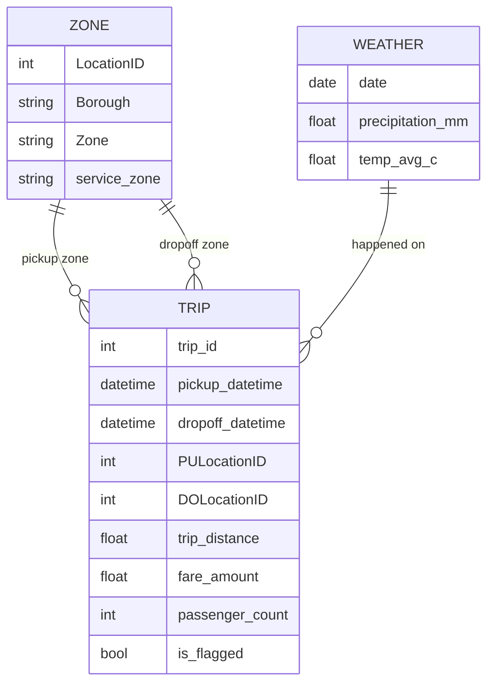
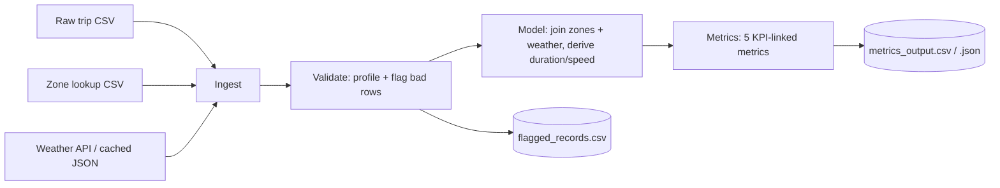

# Workflow / Data Model Diagram

This renders automatically on GitHub (Mermaid support built in).

## Entity / event model

## Pipeline flow

## Notes

- `TRIP` is the event table — one row per trip.
- `ZONE` is joined twice (once for pickup, once for dropoff) since a trip
  has two locations.
- `WEATHER` is joined by date only (daily granularity), not by exact
  pickup time — documented as a limitation in the README.
- Flagged trips are NOT deleted; they flow into `flagged_records.csv`
  separately so nothing is silently dropped.
